# Blog Project

## Description

This app is a simple blog that has a React front end and Express backend. It uses a MongoDb database to store the blog posts and allows the user to log in with 2 different methods (username and password, or Facebook). It also has an admin area that an admin can use to delete other users posts or edit them.

The app has been deployed with Heroku and can be accessed at this URL: [https://chronicles-musing.herokuapp.com/](https://chronicles-musing.herokuapp.com/).

## Content table

<ul>
<li><a href="#technologies">Technologies</a></li>
<li><a href="#installation">Installation</a></li>
<li><a href="#testing">Testing</a></li>
<li><a href="#deployment">Deployment</a></li>
<li><a href="#system-architecture">System Architecture</a></li>
<li><a href="#system-requirements-specification">System Requirements Specification</a></li>
<li><a href="#security">Security</a></li>
<li><a href="#wireframes">Wireframes</a></li>
<li><a href="#usage">Usage</a></li>
<li><a href="#credits">Credits</a></li>
</ul>

# Technologies

This project uses:

- HTML
- CSS
- Javascript
- Node
- React
- React Bootstrap
- Express
- MongoDB
- JSON Web Tokens (JWT)
- Mocha (for testing)

# Installation

To run this project, you will first need to modify the MongoDB URI (Uniform Resource Indicator) to point to your own Mongo database. If you are new to MongoDB, visit this link to create your own free database cluster - [https://docs.atlas.mongodb.com/getting-started/](https://docs.atlas.mongodb.com/getting-started/), then follow the steps below.

1. Log into your MongoDB account [https://account.mongodb.com/account/login](https://account.mongodb.com/account/login).

2. Click on the "Connect" button. See figure 1 below.

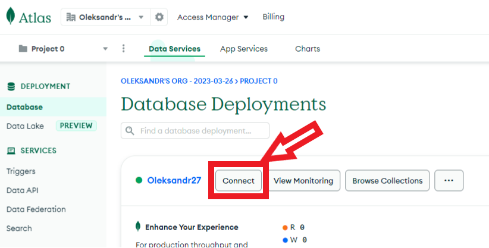
Figure 1

3. Click on the "Connect your application" button. See figure 2 below.

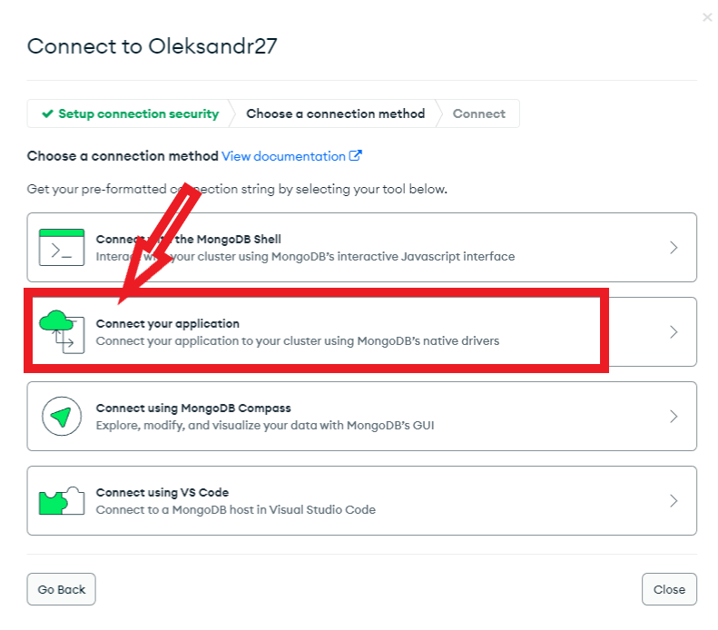
Figure 2

4. Copy the connection string to your clipboard (perhaps save it in a text editor so you don't lose it). This is the database URI that we will need, in order to point the application to your database. See figure 3 below.

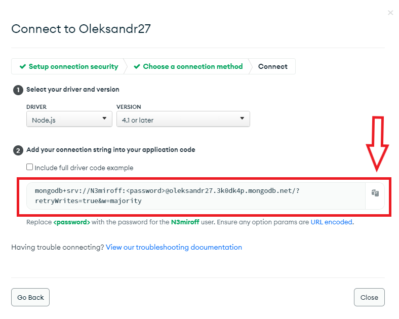
Figure 3

5. Copy the project files of this app to a directory called 'blog' on your local machine.
6. Navigate to this directory from the command line interface. E.g. cd c:/blog. This is the backend of the application.
7. Open the ".env" (1), file of this app as shown in figure 4 bellow.

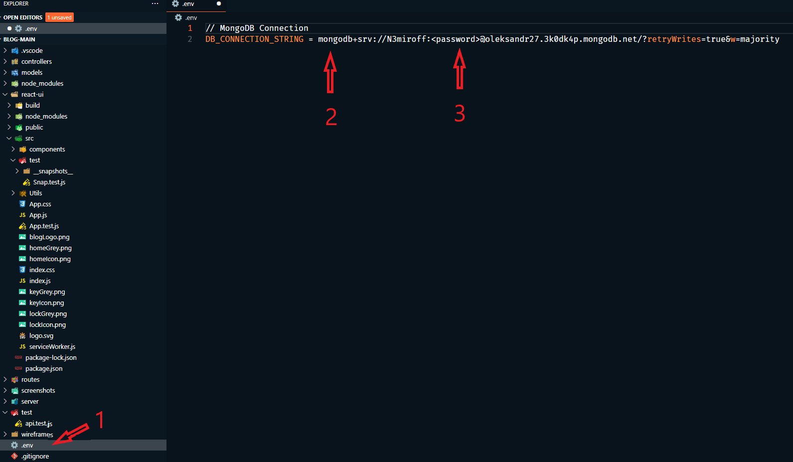
Figure 4

6. Refer to your connection string from step 4 above and paste it inside `DB_CONNECTION_STRING` (2), as follows in the figure above, and last `<password>` (3), replace it with your password.

7. Save the changes to the ".env" file.
8. In the command line interface, type 'npm install'.
9. Once it has finished installing, type 'npm start'.
10. Now navigate to the "/react-ui" directory inside "blog" (this is the frontend of the app). E.g. cd c:/blog/react-ui.
11. In the command line interface, once again type 'npm install'.
12. Once it has finished installing, type 'npm start'.
13. You have now started both the backend and frontend servers.
14. Open [http://localhost:3000](http://localhost:3000) to view the project in your web browser.

# Testing

There are 4 tests for this app (1 snapshot test and 2 unit tests - 1 for frontend and 1 for backend).

A "snapshot test" is ".. a type of “output comparison” or “golden master” testing. These tests prevent regressions by comparing the current characteristics of an application or component with stored “good” values for those characteristics."

A "unit test" is "...an automated test of a unit of source code. A unit test asserts if the unit's behaviour matches expectations."

(source of definitions:
snapshot test: [https://www.sitepen.com/blog/snapshot-testing-benefits-and-drawbacks#:~:text=Snapshot%20testing%20is%20a%20type,from%20unit%20and%20functional%20tests](https://www.sitepen.com/blog/snapshot-testing-benefits-and-drawbacks#:~:text=Snapshot%20testing%20is%20a%20type,from%20unit%20and%20functional%20tests)

unit test: [https://dev.to/dstrekelj/how-to-write-unit-tests-in-javascript-with-jest-2e83](https://dev.to/dstrekelj/how-to-write-unit-tests-in-javascript-with-jest-2e83)
)

### Backend Test

The backend unit test has 2 parts. The first part checks to see that it can successfully reach a resource on the backend server. It succeeds when it receives a status code of "200". The second part of the test checks to see if it returns an expected string of "Welcome to the server!" from the server.

To run the unit test for the backend of the app:

1. Navigate to the "blog" directory from the command line interface. E.g. cd c:/blog.
2. Type "npm test".
3. If the test runs successfully, you should get a response that looks like figure 5 below.

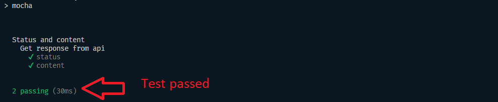
Figure 5

### Frontend Test

The snapshot test for the frontend checks to see that a `<Button>` element renders exactly the same as it did when the snapshot was first recorded. The unit test checks checks that the paragraph element of the Footer component contains the text: "Chronicles & Musing".

To run the snapshot and unit tests for the frontend of the app:

1. Navigate to the "react-ui" directory from the command line interface. E.g. cd c:/blog/react-ui.
2. Type "npm test".
3. If the 3 frontend tests run successfully, you should see a response that looks like figure 6 below.

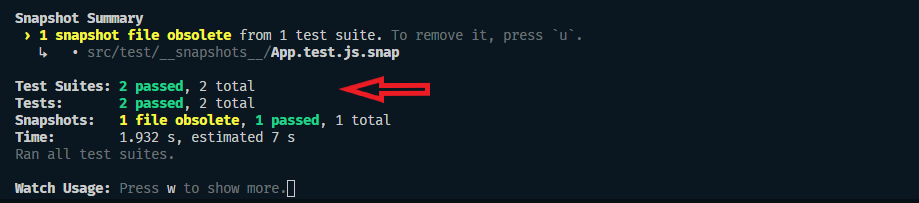
Figure 6

# Deployment

This app has been deployed using Heroku - [https://www.heroku.com/](https://www.heroku.com/). I chose to use Heroku because I became very familiar with it while creating other apps. I chose to deploy the front and backend of the app together, as it seems simpler to me.

# System Architecture

I will be creating a blog app for this task. It will be built using the MERN stack (MongoDB, Express, React and Node) with a React.js front end.
I plan to use heruko to deploy with Heroku when it's finished. I'm using Heroku because I became very familiar with it.

I will be using React Bootstrap to aid me in styling the app attractively, since I am very familiar with using bootstrap and I think the end result looks great. I also firmly believe in using libraries such as bootstrap to make my job of coding easier and quicker. My app will have an Express backend server that will read, write, update and delete data from MongoDB using a REST api. I will use JSON Web Tokens (JWT) for authentication and the users will be able to log in using Facebook or their own username and password. Users with Admin rights will be able to modify other user's blog data, while non-admin users will only be able to modify their own blog data. However, any visitor to the website will be able to view all the user's blog entries without having to log into the system.

I will make use of a modular approach when coding this app, with many separate "Components" and functions to simplify things and make the code easier to understand and maintain in the future. I will also make use of different "Routes" for the same reason.

## System Requirements Specification

### How this app will work

When a user first lands on the page, they will be able to view the blog articles that other users have created. They will be able to select which user's blogs to view by clicking on the user's name in the menu on the left side of the page. Each blog will only show part of the article, so that it doesn't take up too much space on the page. However, if the user clicks on the "Read more..." link, they will be taken to a page that allows them to read the whole article.

User's who would like to create their own blog posts will be able to click the "Register" button in the header and enter their username and password (or register with Facebook/Google). Once they have registered and logged in with their credentials, they will be able to create their first blog article. They will be able to save it, update it or delete it later on, should they choose to. All their articles will be saved to the MongoDB database, so that they remain accessible next time the user visits the website. Other web visitors will be able to view their articles, but will obviously not be able to modify them. Only an authenticated user can modify their own blog posts.

There will be one user with "Admin" rights who will be able to modify any other user's blog articles. All other users will be "non-admin" and will only be able to modify their own blogs.

### Who will use the app and why

Anyone can utilize this blog app and will be able to enjoy having the freedom to voice their opinions and experiences in the public space, while retaining anonymity, should they wish to keep their identity a secret. Of course, they are also free to use their real name as well. This blog can also serve as an online diary or journal for people who want to get their thoughts written down as a form of therapy or just a way to make sense of their experiences. Since the app saves all their articles in the cloud, it removes the need for them to consider backups, which will be very appealing to many people. Having their articles online is also superior to writing them down in a physical notebook in many cases, as some people may not want family members or friends to discover and read their private thoughts.

### Other similar websites

The 2 most popular blogging platforms on the web today are "Wix" and "Wordpress". My blog application will differ from these platforms, in that it will be much simpler and with fewer features. This is an advantage and will be a refreshing change for many users, as it will reduce the learning curve for people new to blogging. There will be no need to spend hours trying to figure out how to set up a blog, and it will also encourage older users who have very little IT experience, since they would be put off by more complex interfaces.

My blog will appeal to users who desire a clean and neat interface with minimal bells and whistles. It will do one thing (allow users to blog), but it will do that thing very well indeed. Perhaps some users will decide later on that they want more complex functionality, and they may migrate to other, more well known platforms, but this app will be a great place for anyone to start their blogging journey.

### Functional Requirements

1. User authentication: Register new user with Facebook or their username and password or same to login
2. Adding New Blog: User must be able to create a new blog with title and text area to write the blog
3. Blog Update: User must be able to Update/edit existing blog article
4. Blog Deletion: User must be able to delete a blog article
5. View Article: User must be able to View existing articles from all users or view articles from a specific user only
6. Admin: Admin must be able to edit any user's blog article or delete any user's blog article

### Non-functional Requirements

#### Usability

1. The blog app should have a simple and intuitive user interface similar to other blog websites that user's may have seen elsewhere. I am not trying to develop something vastly different or complex here, since that will detract from the overall user experience.

2. The position and appearance of buttons, navigational links and content will conform to normal web standards that most user's should be familiar with. Effort will be made to ensure that users do not need to consult a help file to use the interface.

3. Forms will have some basic validation to make sure users can't submit blank forms or accidentally delete blog articles (i.e. they will be shown a warning message if they try to do either of these things).

4. There will be various elements on the page to ensure that users always know where they are (breadcrumbs) and whether they are logged in or logged out (message at top right of page) to reduce confusion.

#### Reliability

1. Error messages will be clear and helpful, rather than the usual, confusing messages.

2. As stated above, validation will reduce issues due to users entering blank form fields or accidentally deleting articles.

3. App will use MongoDB for the database. This eliminates the need to be worried about backing up blog articles, since that is all handled by MongoDB.

4. Mongo also allows for upgrades/updates to the database with no downtime to the website.

#### Performance

This app will be built using the "Create react app" starter kit created by Facebook. This not only makes it much quicker and easier for me to code my app, but improves the speed of the website by using a "virtual DOM", instead of rewriting the DOM every time a change is made to the HTML of the page.

This app will use MongoDB as a database, which is a huge advantage for performance, as there is no need for downtime when upgrading or scaling the database up. This is because Mongo uses a NoSQL database structure.

#### Implementation Requirements

1. The app must be browser-based and built using the MERN stack (MongoDB, Express, React, and Node).

# Security

1. Only users that have been authenticated with a valid JSON Web Token (JWT) will be permitted to modify blog posts, and they will only ever be able to modify their own posts. Only the single Admin user will have rights to modify any user's blog articles.

2. "Helmet" Express middleware will be used by the Express backend to further tighten up security. See [https://www.npmjs.com/package/helmet](https://www.npmjs.com/package/helmet) for details.

### User Stories

1. John wants to be able to register using my Facebook or Google account, so that I can start creating and publishing my own blog posts without having to create a new username and password.
2. Bob wants to be able to update my existing blog posts, so that I can correct any errors or add additional information if needed.
3. Matt as a registered user, I want to be able to delete my own blog posts, in case I change my mind or no longer want them to be available for others to read.
4. Hannah as a visitor to the site, I want to be able to view all the blog posts that have been published by users, so that I can read and learn from their experiences.
5. George as an admin user, I want to be able to edit or delete any blog post created by any user, so that I can ensure that the content on the site is appropriate and does not violate any rules or guidelines.

# Wireframes

I created wireframes of how I wanted the user interface (UI) of this app to look before I started coding it. I used Draw.io ([https://www.diagrams.net/](https://www.diagrams.net/)) to create/plan them. I have included PDF files for all of the wireframes in the "wireframes" directory of this project.

# Usage

### For Non-admin Users

1. Once you open the project in your browser [http://localhost:3000](http://localhost:3000), you will see the home page of the blog. See figure 7 below.

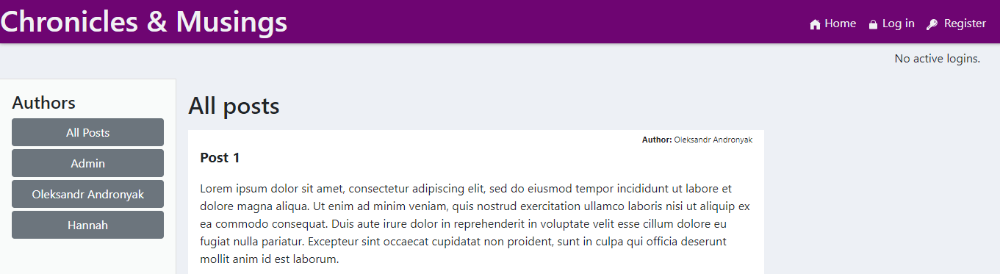
Figure 7

2. Scroll down the page to read any existing blog posts from other users, or click on the name of a specific blog author on the left side of the page to only see posts created by that author. See figure 8 below.

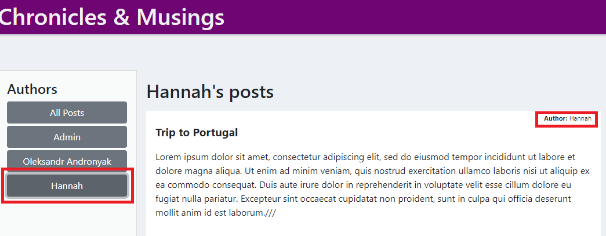
Figure 8

### Register

3. If you would like to "register" or "sign up" to create your own blog posts on the site, click the "Register" link at the top right corner of the page. See figure 9 below.

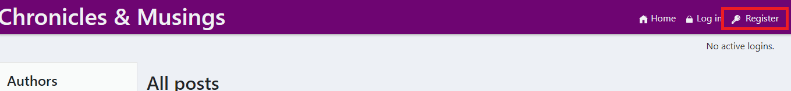
Figure 9

4. You will be taken to a page where you can enter a username and password to register. See figure 10 below.

Figure 10

### Log in

5. Once you have registered, you can click on the "Login" link on the top right hand side of the page. See figure 11 below.

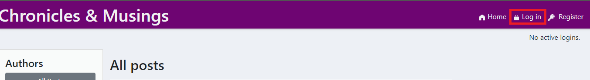
Figure 11

6. You can now log in with the username and password you just used to register with. OR if you prefer, you can click the appropriate button to log in with Facebook. See figure 12 below.

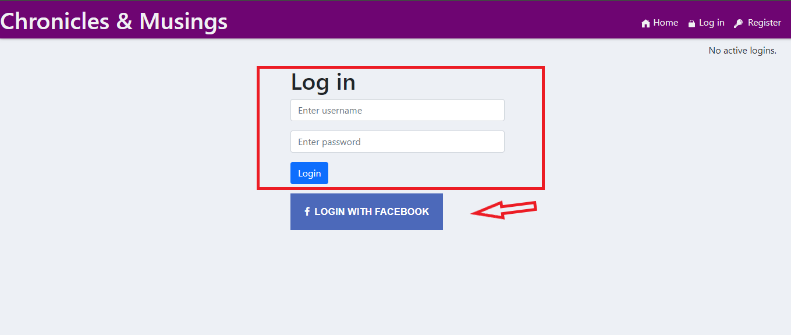
Figure 12

### Create Blog Post

7. Once you have logged in, you will be able to create your very own blog post. Simply type in an appropriate title for your post (step 1), type your actual blog post or article (step 2) and then click the "Save Post" button at the bottom when you are happy with it (step 3). See figure 13 below.

Figure 13

8. To view the post that you just created, click on the "Home" link at the top right hand side of the page and then click on your name button under "Authors" on the left side of the page. See figures 14 and 15 below.

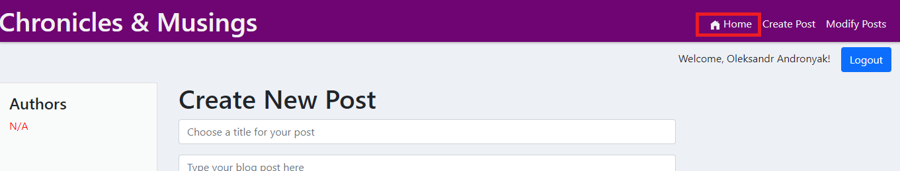
Figure 14

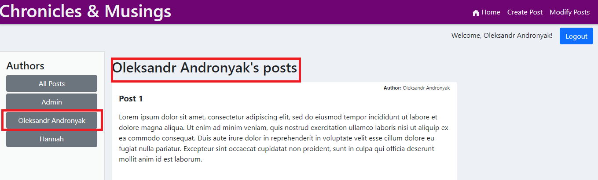
Figure 15

### Edit Blog Post

1. To edit one of your blog posts, click on the "Modify Posts" link at the top right side of the page. See figure 16 below.

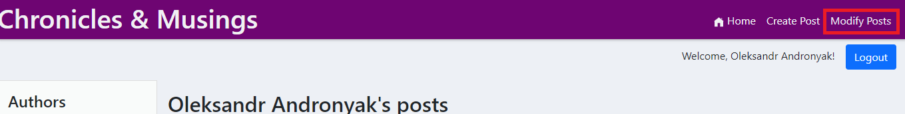
Figure 16

2. You will now see all your posts and each post will have a "Edit Post" and "Delete Post" buttons underneath them. To edit a specific post, click on the "Edit Post" button for that particular post. See figure 17 below.

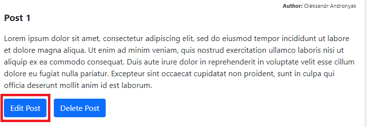
Figure 17

3. You will then be able to change the title and/or the main body of the post. When you have made your changes, click on the "Update Post" button to save the changes. If you do not want to save your changes and you would rather just cancel, click the "Cancel" button. See figure 18 below.

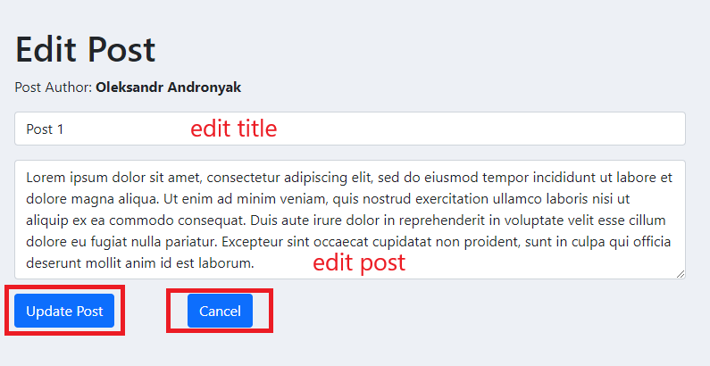
Figure 18

### Delete Blog Post

1. To delete one of your blog posts, click on the "Delete Post" button underneath the post you would like to remove. You will be asked if you are sure you want to delete the post. Click the "Ok" button to delete it or click "Cancel" if you no longer want to delete the post. See figure 19 below.

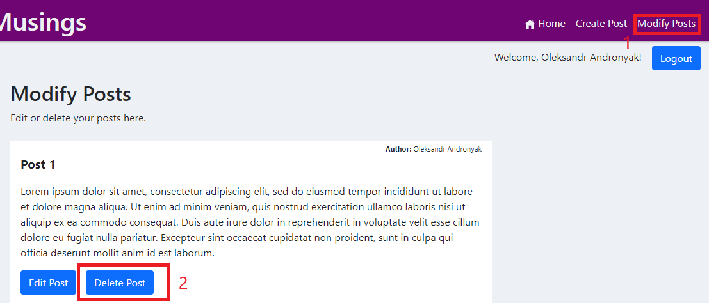
Figure 19

### Log Out

To log out of the website, just click on the "Logout" button next to your name at the top right part of the page. See figure 20 below.

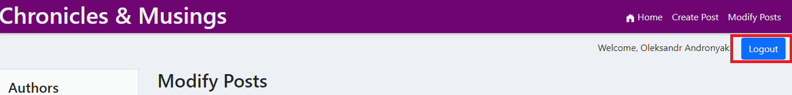
Figure 20

### For Admin Users

1. There is only one admin user by default. This user has the rights to edit and delete any other user's blog posts. Once the admin user has logged in (as explained in the "Log In" section above), they will see the word "(admin)" next to their username at the top right hand side of the page. See figure 21 below.

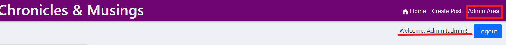
Figure 21

2. To edit or delete another user's post, first click on the "Admin Area" link at the top right of the page. See figure 21 above.

3. You will then see all the other user's blog posts as you could on the "Home" page. However, now you will notice that each post has an "Edit post" and a "Delete post" button underneath it. See figure 22 below.

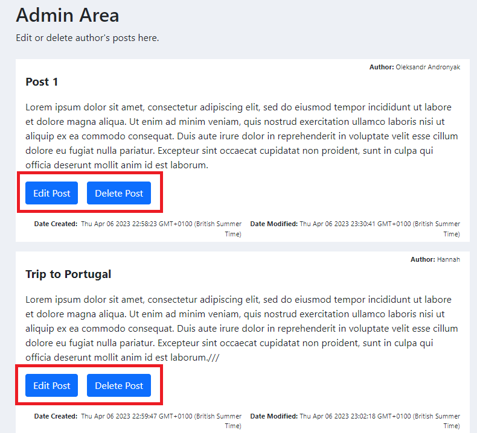
Figure 22

4. To choose a post, either scroll down the page to the specific user's post that you would like to edit/delete, or click on the name of the user in the left hand side "Authors" section to see only that user's posts. See figure 23 below.

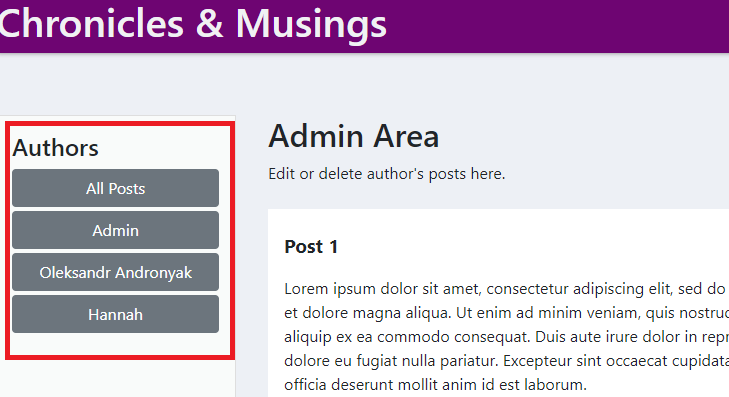
Figure 23

### Edit Blog Post (admin)

1. To edit a user's post, click on the "Edit Post" button at the bottom of the post you want to edit/update. You will then be able to change the title and/or the main body of the post. When you have made your changes, click on the "Update Post" button to save the changes. If you do not want to save your changes and you would rather just cancel, click the "Cancel" button. See figure 24 below.

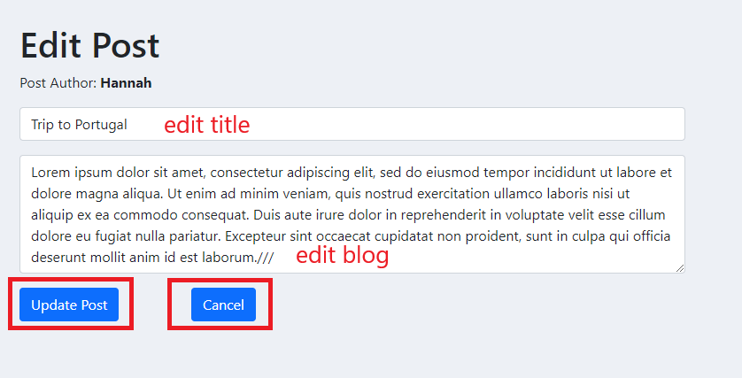
Figure 24

### Delete Blog Post (admin)

1. To delete a user's blog post, click on the "Delete Post" button under the post you want to remove. You will be asked if you are sure. Click "Ok" to delete the post, or "Cancel" to go back without deleting it. See figure 25 below.

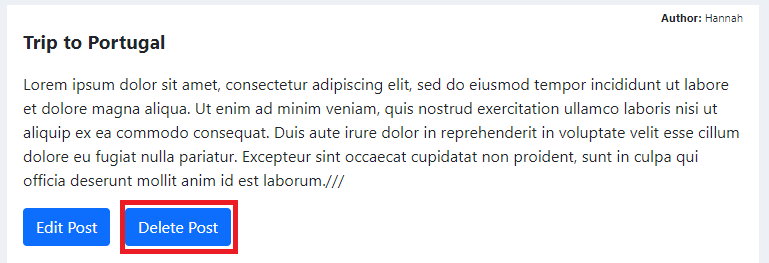
Figure 25

# Credits

This project was created by Oleksandr Andronyak as part of a task for HyperioDev Full Stack Development Bootcamp - April 2023 [GitHub profile](https://github.com/OleksandrAndronyak)

I would also like to acknowledge the following resource:

`Drear Programmer` YouTube channel, which provided helpful tips and inspiration for styling and working with React. You can find more of their content at [Youtube Profile](https://www.youtube.com/@DearProgrammer)
